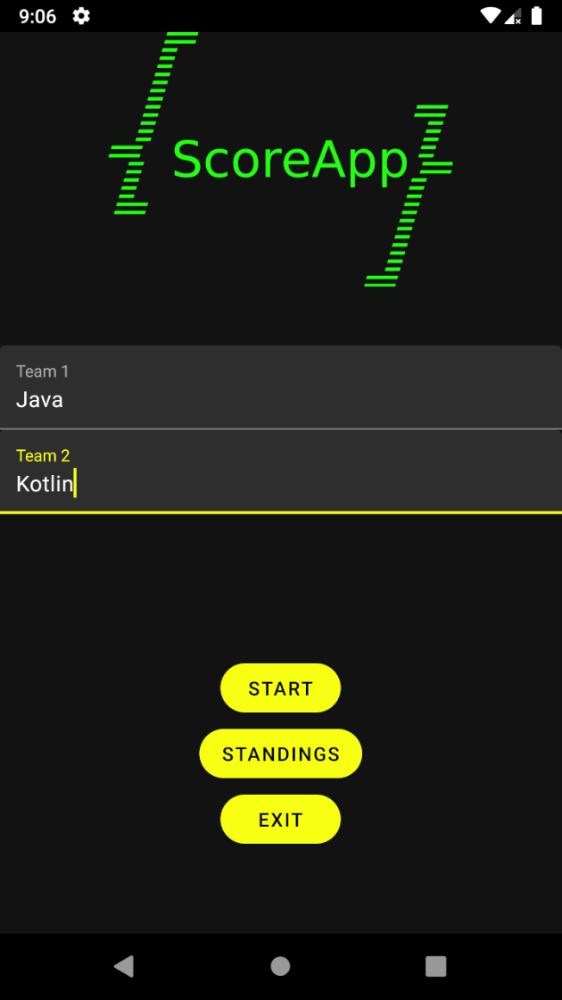
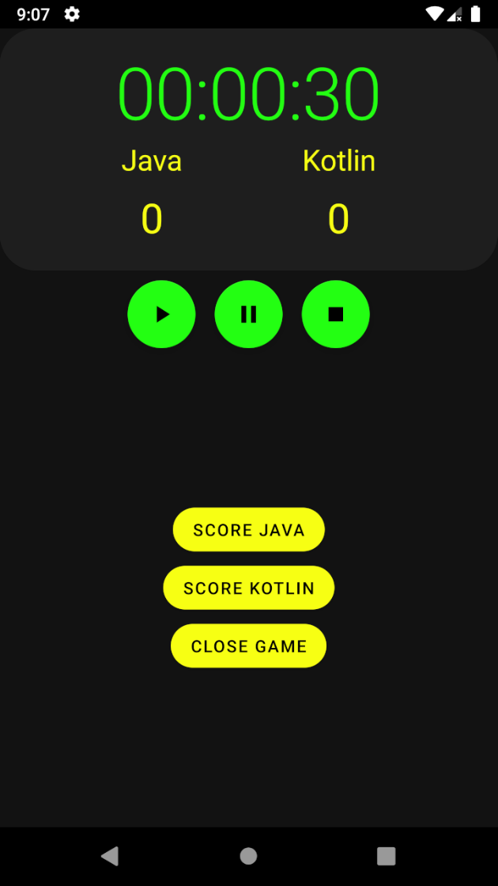
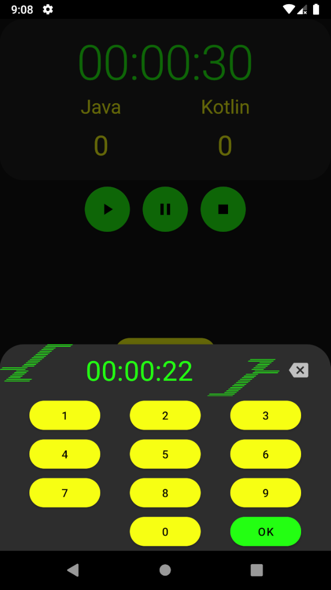
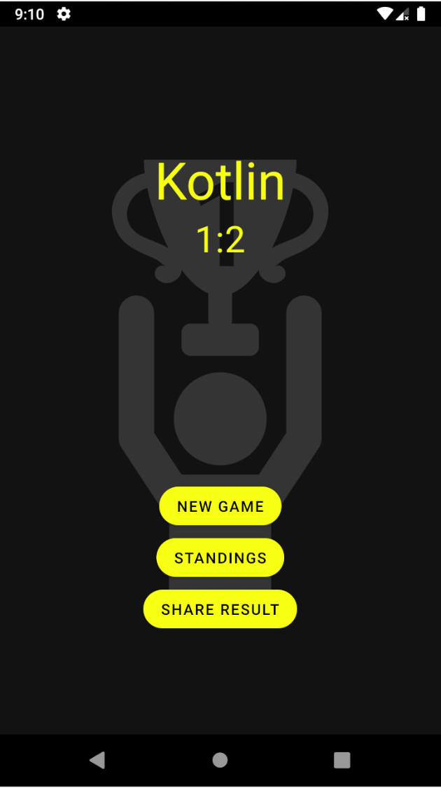
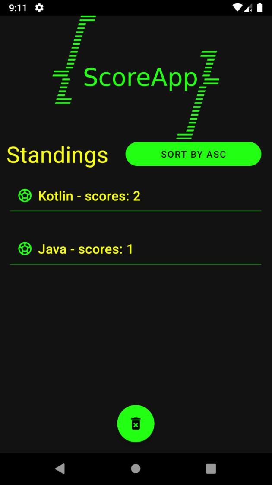

# ScoreApp

Додаток містить 4 екрани побудованих на фрагментах(start screen, game screen, winner screen, standings screen).
- Start screen  
Ввід команд.
- Game screen  
Містить табло з таймером та очками команд.
- Winner screen  
Переможець гри або нічия.
- Standings screen  
Список команд та їх очок за всі ігри протягом однієї сесії.

Таймер для гри реалізований за допомогою Handler.  
Для збереження стану при зміні життєвого циклу Fragment використовується ViewModel та onSaveInstanceState.  
Для відображення списку команд використовується RecyclerView.  
Існує можливість встановлення таймеру, для цього використовується BottomSheetDialogFragment.  

Також реалізовано функціонал:
- Призупинення та зупинки(скидання) гри.
- Сортування списку команд в спадаючому та зростаючому порядку.
- Можливість поділитися результатами гри.
- При згортанні додатку під час запущеної гри з'являється Notification з таймером гри, при поверненні в додаток Notification зникає.

## Screenshots

    
